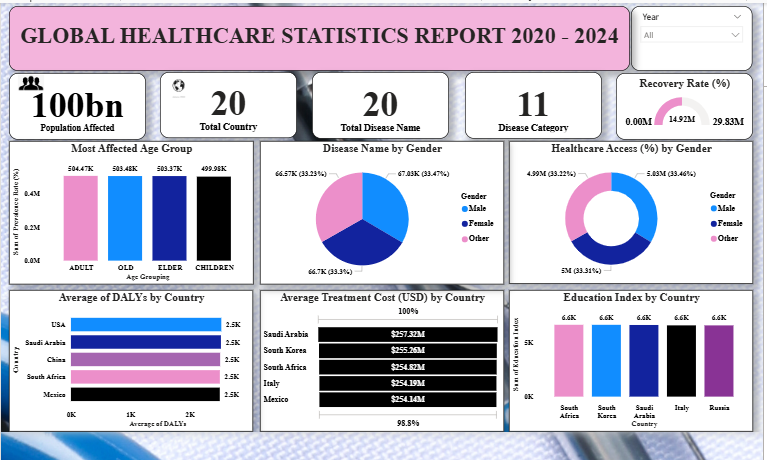

# Global-health-statistics-report-2020-2024
This global statistics report provides comprehensive data and analysis on worldwide trends in key areas such as health, education, economy, environment, and population. It helps policymakers, researchers, and organizations make informed decisions by offering reliable insights based on data collected across countries and regions.

# steps 1

